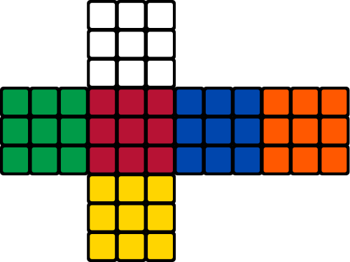
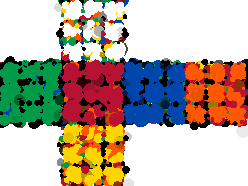
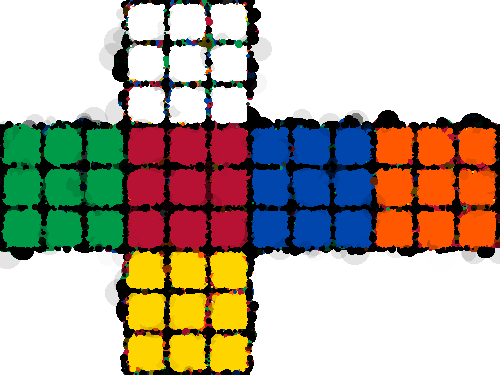

# image-dotter

Image-dotter takes an image and attempts to replicate it using random circles.

This is just a little project done when I was learning go.

---

## Usage

```bash
$ ./image-dotter original_image.png
```

After that, let the program run as long as you like. After you wish to quit, type `q` and hit `enter`. The
output is saved in `out_<originalFilename>`.

The longer you let the program run, the better the end result.

---

## Example:

### Original image:



---

### Output after 50,000 iterations


---

### Output after 500,000 iterations


